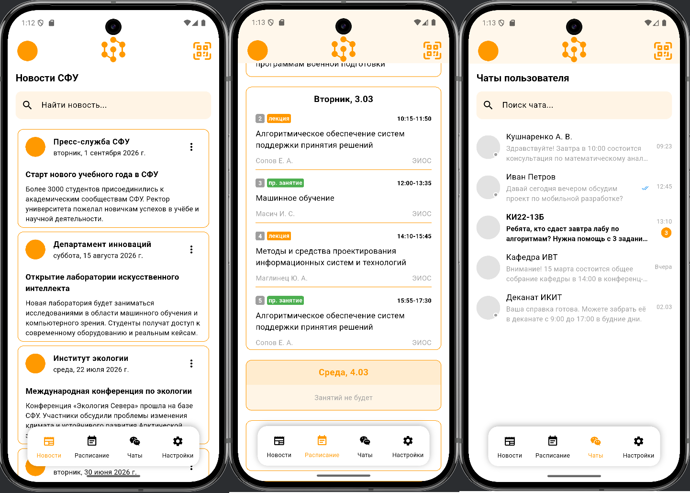
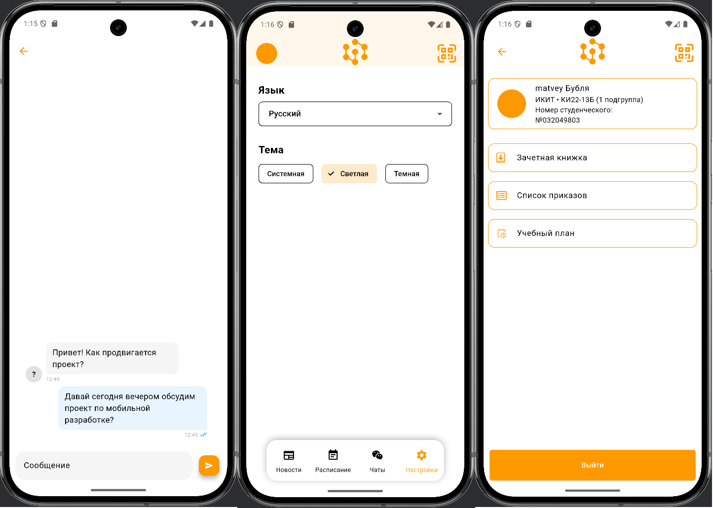
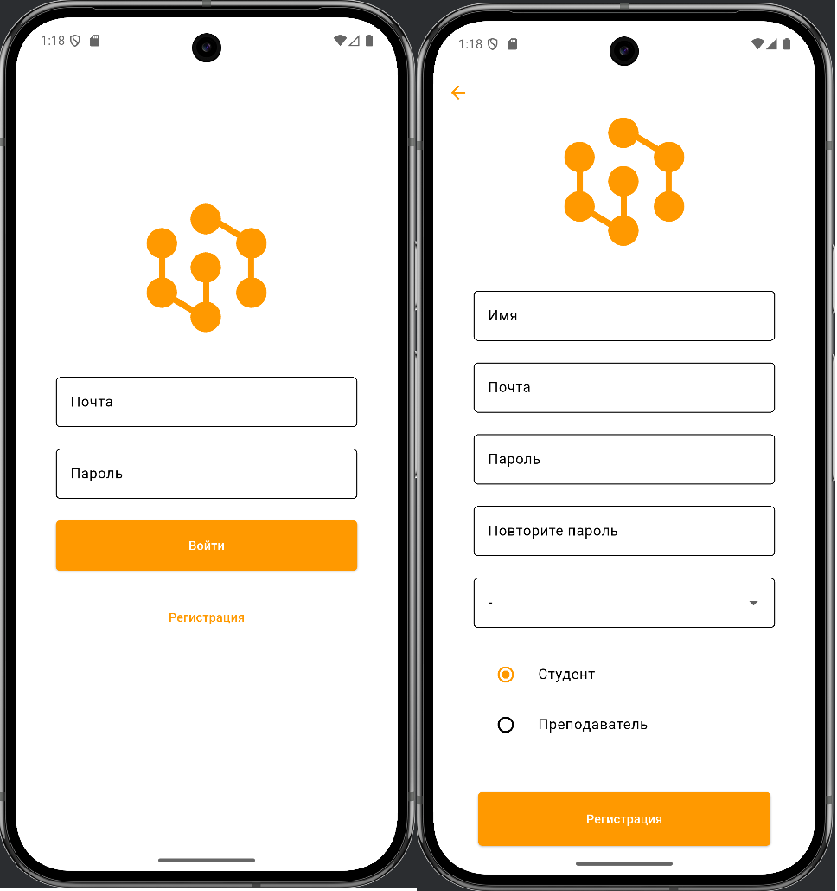
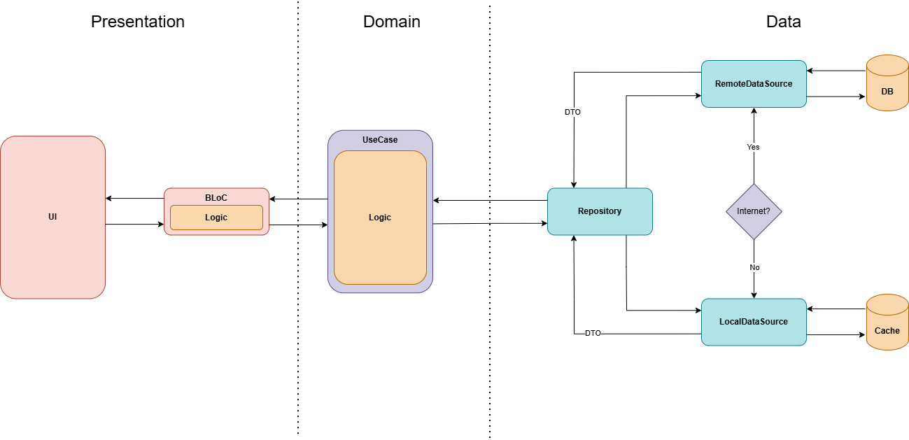

# 📱 SFU — Мобильное приложение для студентов ИКИТ СФУ

Мобильное приложение для студентов кафедры «Систем искусственного интеллекта»
Институт компьютерных информационных технологий, Сибирский федеральный университет

## 🎯 Основной функционал



### 📰Новости ИКИТ СФУ
Просмотр актуальных новостей кафедры: мероприятия, конкурсы,явления, конференции.

### 📅 Расписание занятий
Отображение расписания по неделям (чётная/нечётная), с возможностью фильтрации по дням. Автоматическое обновление статуса пар («Начнётся через», «Идёт», «Закончится»).

### 💬 Чаты
Общение с преподавателя, группой, потоком и старостой в едином интерфейсе — как в Telegram:

### 🔍 QR-сканирование
Скание QR-кода на паре для автоматической отметки посещаемости. Поддержка офлайн-режима с последующей синхронизацией.



## 🔐 Авторизация



Авторизация реализована через Firebase Authentication:
- Вход по email/password
- Кэширование профиля (ФИО, группа, подгруппа, роль) в SharedPreferences
- Поддержка двух режимов: локальный API и Firebase (через DI)

## 🏗️ Архитектура проекта

### Структура файлов
```txt
lib/
├── app/
│   ├── di/
│   ├── screens/
│   └── widgets/
├── core/
│   ├── auth/
│   ├── localization/
│   ├── theme/
│   └── utils/      
├── feature/           
│   ├── chat/
│   │   ├── data/
│   │   │   ├── data_source/
│   │   │   ├── DTO/
│   │   │   └── repository/      
│   │   ├── domain/
│   │   │   ├── entity/
│   │   │   ├── repository/
│   │   │   └── use_case/
│   │   └── presentation/
│   │       ├── bloc/
│   │       ├── screens/
│   │       └── widgets/
│   └── ...
└── main.dart           
```
### Компонентная архитектура

