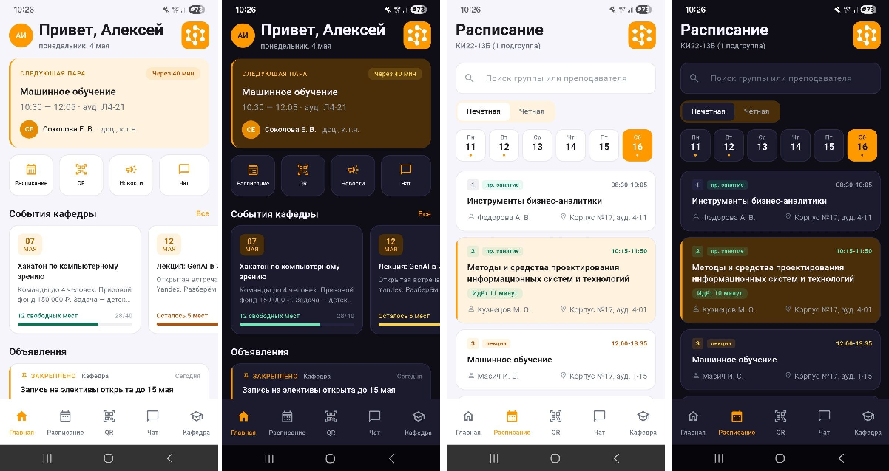
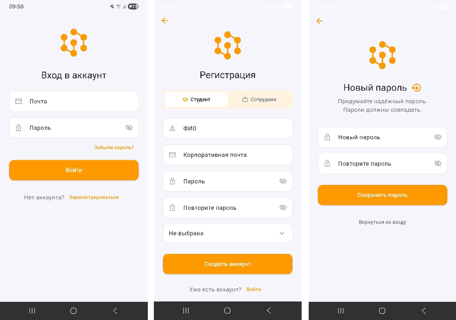
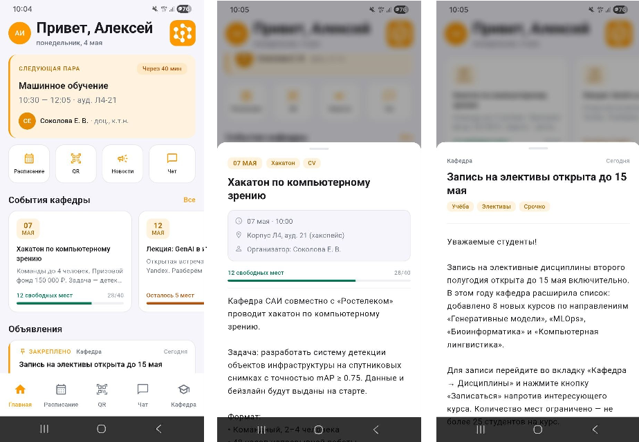
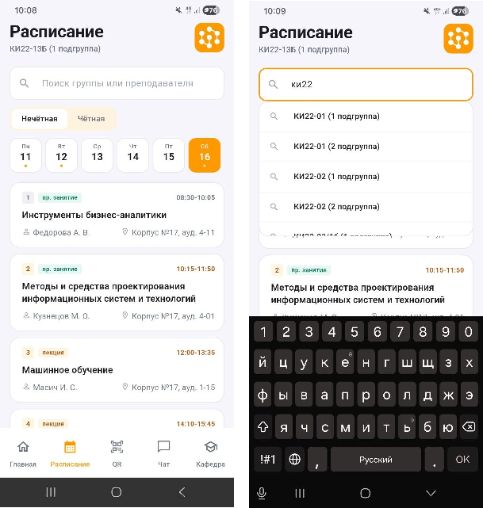
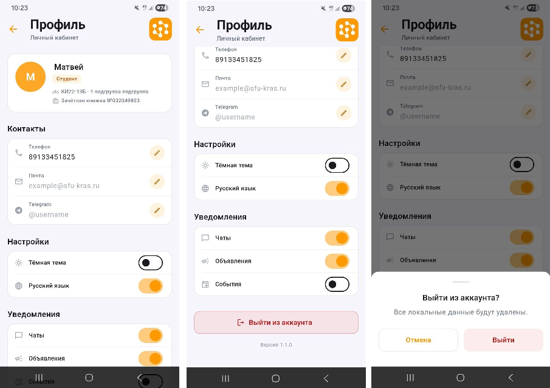
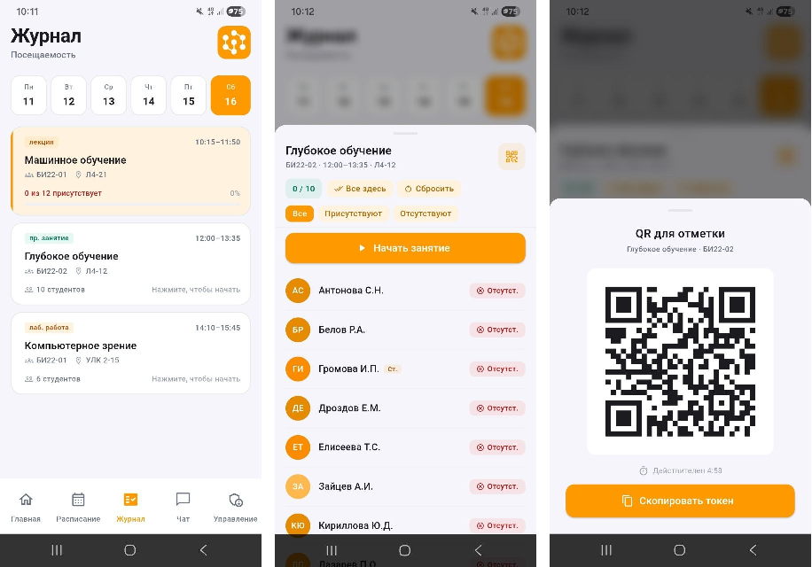
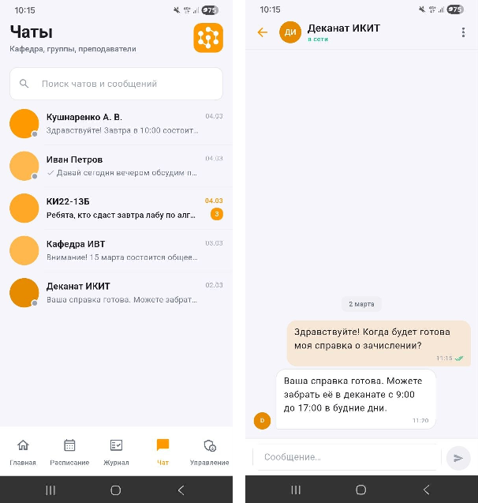
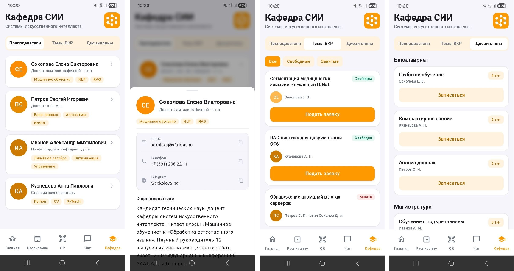
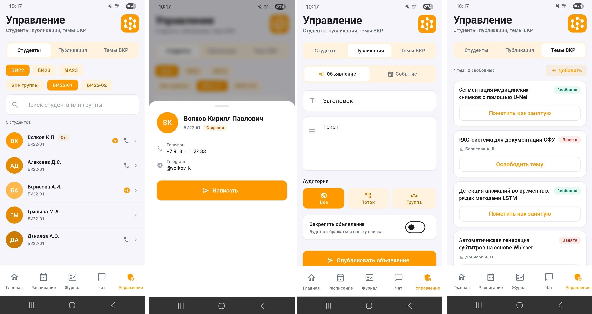

# SFU — Мобильное приложение ИКИТ СФУ

Мобильное приложение для студентов и преподавателей кафедры «Систем искусственного интеллекта» Института компьютерных информационных технологий Сибирского федерального университета.

Приложение позволяет просматривать расписание занятий, следить за объявлениями и событиями кафедры, отмечать посещаемость через QR-коды и управлять своим профилем. Поддерживаются роли студента, преподавателя и администратора с разным набором доступных функций.

---

## Интерфейс

Приложение поддерживает светлую и тёмную тему, переключаемую вручную или синхронизируемую с системными настройками устройства.

| Светлая тема | Тёмная тема |
|:---:|:---:|
|  | |

---

## Авторизация



Вход в приложение выполняется по email и паролю через REST API. После успешной авторизации access- и refresh-токены сохраняются в защищённом хранилище (`FlutterSecureStorage`).

При каждом запросе к защищённым эндпоинтам Dio-интерцептор автоматически добавляет заголовок `Authorization: Bearer <token>`. Если сервер возвращает 401, интерцептор пытается обновить токен через `/auth/refresh`. При неудаче токены очищаются и пользователь перенаправляется на экран входа без каких-либо дополнительных действий с его стороны.

---

## Главный экран



Главный экран собирает ключевую информацию в одном месте:

- Карточка ближайшей или текущей пары с автообновлением каждые 30 секунд. Показывает статус: «Идёт N минут», «Начнётся через N минут», «Сегодня пар нет», «На сегодня всё». Первая пара дня показывается только если до неё осталось менее 90 минут.
- Информационные карточки с количеством актуальных объявлений и предстоящих событий, быстрый переход к расписанию.
- Лента объявлений кафедры с поддержкой закреплённых записей и тегами.
- Горизонтальная карусель событий с индикатором заполненности мест.

Между разделами приложения можно переключаться как через нижнюю навигацию, так и свайпами влево и вправо.

---

## Расписание



Расписание загружается с сервера по идентификатору группы студента или преподавателя, который извлекается из профиля автоматически после входа.

- Переключение между чётной и нечётной неделями через пилюлю-переключатель.
- Навигация по дням недели через чипы с датами.
- Цветовая маркировка типа занятия: лекция, практическое занятие, лабораторная работа.
- Статус пары в реальном времени: «Идёт», «Начнётся через N минут», «Закончилась».
- Поддержка ЭИОС-пар: вместо аудитории отображается ссылка на курс.
- Поиск расписания произвольной группы или преподавателя.
- Обновление по свайпу вниз.

---

## Профиль



Карточка профиля показывает имя, роль и аватар пользователя. По нажатию открывается шторка с подробными данными.

Для студента отображаются: группа, подгруппа, поток, номер зачётной книжки, институт, дата рождения.

Для преподавателя: должность, учёная степень, кафедра, институт, теги научных интересов.

На экране профиля можно редактировать контактные данные (телефон, email, Telegram), биографию (для преподавателей), настройки темы, языка интерфейса и push-уведомлений. Аватар выбирается из галереи устройства.

---

## Посещаемость



Преподаватель создаёт сессию посещаемости на текущую пару. Студенты сканируют QR-код и получают отметку. Преподаватель видит список студентов в реальном времени и может вручную скорректировать статусы. По окончании пары сессия закрывается.

---

## Чат



Список чатов с преподавателями, группой и потоком. Интерфейс сообщений построен по привычной схеме мессенджера: пузыри с временными метками, разделители по датам.

---

## Кафедра



Список преподавателей кафедры с карточками: должность, учёная степень, контактные данные, теги научных интересов.

---

## Управление

Раздел доступен преподавателям и администраторам.



- Публикация объявлений с таргетингом по конкретным группам или потокам.
- Создание событий кафедры с указанием аудитории и времени проведения.
- Работа с дипломными работами: создание, редактирование, просмотр статусов.
- Просмотр списков студентов по группам.

---

## Архитектура

Проект построен по принципам Clean Architecture. Каждая фича независима и содержит три слоя: данные, домен и представление.

```
lib/
├── main.dart
└── src/
    ├── app/
    │   ├── dependency_injection/      # GetIt — регистрация всех зависимостей
    │   └── screens/                   # Навигация, HomeScreen, AuthWrapper
    ├── core/
    │   ├── auth/                      # AuthBloc, токены, интерцептор авторизации
    │   ├── error/                     # AppException, ExceptionHandler, типы ошибок
    │   ├── request/                   # Два Dio-клиента: публичный и авторизованный
    │   ├── theme/                     # AppTheme, AppColors, расширения темы
    │   ├── localization/              # Локализация (ru / en)
    │   └── widgets/                   # Переиспользуемые виджеты: UserAvatar, DetailSheet
    └── feature/
        ├── announcements/             # Объявления кафедры
        ├── attendance/                # Посещаемость и QR-сессии
        ├── chat/                      # Чат и сообщения
        ├── department/                # Сотрудники кафедры
        ├── events/                    # События кафедры
        ├── management/                # Управление (для преподавателей)
        ├── profile/                   # Профиль пользователя
        ├── qr/                        # QR-сканирование
        ├── settings/                  # Настройки темы и языка
        └── timetable/                 # Расписание занятий
```

Структура каждой фичи:

```
feature/example/
├── data/
│   ├── data_source/       # Remote (Dio) и Local (SecureStorage / SharedPreferences)
│   ├── dto/               # DTO — точная копия ответа сервера (freezed + json_serializable)
│   ├── mapper/            # Преобразование DTO в доменную модель
│   └── repository/        # Реализация репозитория
├── domain/
│   ├── entity/            # Доменная модель (freezed)
│   ├── repository/        # Интерфейс репозитория
│   └── use_case/          # Use cases
└── presentation/
    ├── bloc/              # BLoC: события, состояния, freezed
    ├── screens/           # Экраны
    └── widgets/           # Виджеты экрана
```

Поток данных: `DataSource → Repository → UseCase → Bloc → Widget`. Виджеты только отображают данные из состояния блока и отправляют события. Вся бизнес-логика сосредоточена в use cases и маппере.

DTO хранит поля в типах, которые сервер фактически возвращает (часто `String` вместо `int`). Маппер приводит их к удобным для UI типам и добавляет синтетические поля, которых на сервере ещё нет.

---

## Стек технологий

| Категория | Библиотеки |
|---|---|
| Архитектура | Clean Architecture, BLoC pattern |
| State management | `flutter_bloc`, `freezed` |
| Dependency injection | `get_it` |
| Сеть | `dio` с интерцептором авторизации и автообновления токенов |
| Сериализация | `json_serializable`, `freezed_annotation` |
| Локальное хранилище | `flutter_secure_storage`, `shared_preferences` |
| UI | `flutter_svg`, `shimmer`, `intl` |
| Камера и QR | `mobile_scanner`, `image_picker`, `qr_flutter` |
| Окружение | `flutter_dotenv` |

---

## Запуск

Создать файл `.env` в корне проекта:

```env
API_BASE_URL=https://your.api.host/api/v1
```

Установить зависимости и сгенерировать freezed-код:

```bash
flutter pub get
dart run build_runner build --delete-conflicting-outputs
```

Запустить приложение:

```bash
flutter run
```

---

## Требования

- Flutter SDK `^3.8.0`
- Dart SDK `^3.8.0`
- Android: `minSdk 23`, `compileSdk 35`, Android Gradle Plugin `8.9.1+`
- iOS: `14.0+`

---

## Структура скриншотов

Для корректного отображения изображений в README положите файлы скриншотов в папку `screenshots/` в корне репозитория со следующими именами:

| Экран | Имя файла |
|---|---|
| Светлая и тёмная тема | `theme_light_dark.png` |
| Авторизация | `auth.png` |
| Главный экран | `home.png` |
| Расписание | `timetable.png` |
| Профиль | `profile.png` |
| Посещаемость | `attendance.png` |
| Чат | `chat.png` |
| Кафедра | `department.png` |
| Управление | `management.png` |
